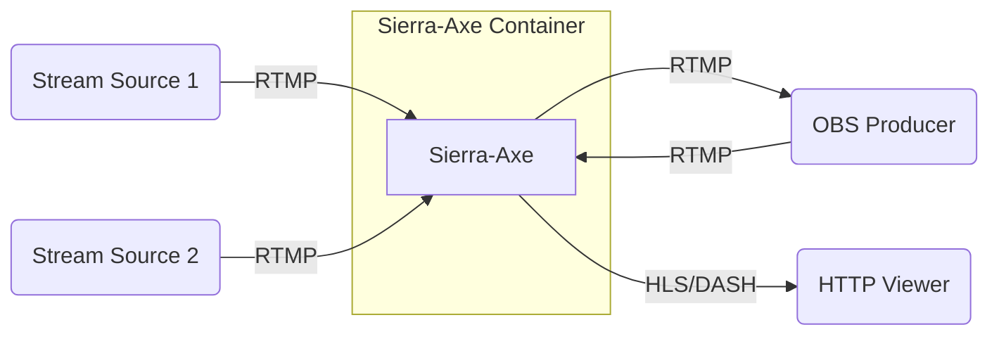

# Sierra-Axe Video Streaming Server

A Dockerfile installing NGINX, nginx-rtmp-module and FFmpeg from source with
default settings for HLS and DASH live streaming. Built on Alpine Linux.

The server allows video streaming sources to be streamed over RTMP, which then are converted to mpeg streams viewable over an HTTP webpage or as a raw RTMP source.  Multiple stream sources are available, so you may have a large amount of input streams, that are consumed by a "video producer" using software such as [OBS Studio.](https://obsproject.com/)  The producer may then edit the streams, feeding back a master stream viewable by end users.



### Server

* Build and run container from source:

```cmd
docker build --no-cache -t sierra-axe .
docker run -it -p 1935:1935 -p 8080:80 --rm sierra-axe
```

### OBS Configuration

* Stream Type: `Custom Streaming Server`
* URL: `rtmp://sierra-axe-server:1935/stream`
* Stream Key: $STREAM_NAME <- unique stream key for that particular instance

* or with ffmpeg the destination will be:

```cmd
rtmp://sierra-axe-server:1935/stream/$STREAM_NAME
```

### Watch Stream

* The RTMP streams can be watched directly with the source:

```cmd
rtmp://sierra-axe-server:1935/stream/$STREAM_NAME
```

* Browser based viewing using HLS:

```cmd
http://sierra-axe-server/view/$STREAM_NAME
```

* or the alternate viewer using DASH:

```cmd
http://sierra-axe-server/dash/$STREAM_NAME
```
